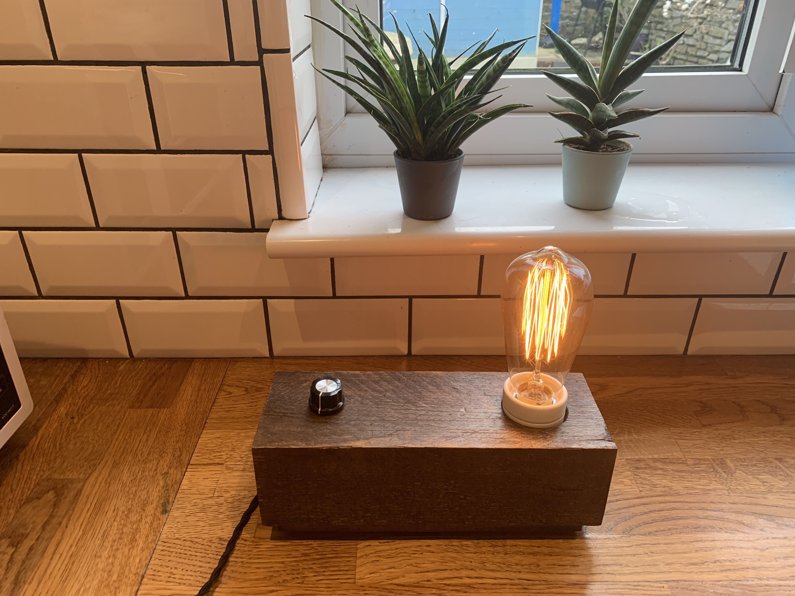
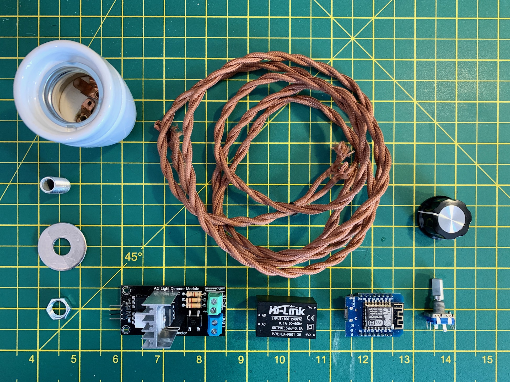

# AlexaLamp
This project is to create a lamp with Alexa voice control where you can also change the brightness using a rotary encoder with push switch.

## Components

* Wemos D1 Mini
* HLK-PM01 AC-DC 220V to 5v mini power supply module
* Robotdyn AC Light Dimmer Module (https://robotdyn.com/ac-light-dimmer-module-1-channel-3-3v-5v-logic-ac-50-60hz-220v-110v.html)
* KY-040 rotary encoder with push switch
* Bulb holder and fittings
* MF-A03 control knob
* Power cord and plug 

## Electronic Schematic

## Instructions

* Build circuit on a breadboard 
* Compile and upload code to Wemos D1
* Test everything works
* Take a wooden block and hollow out
* Put all the components into the cavity but **ensure wires carrying 240v are away from Wemos and dimmer control board because it will affect dimming** 

## How to use

The lamp has 2 modes: Alexa (default) and standalone.  To change the mode, power cycle the lamp whilst holding the rotary encoder push switch down until the lamp slowly flashes.  The number of flashes is to let you know which mode the lamp is currently in.  1 flash indicates standalone and 2 flashes is Alexa mode.

### Alexa mode (default)
* When the lamp is turned on for the first time it will create an unsecured wifi hotspot called Lamp
* You can use your phone to connect to the hotspot and enter your wifi network credentials
* Once your credentials are verified, the hotspot will disappear and your settings will be stored
* The lamp will now connect to your network and you will be able to control the lamp using the rotary encoder
* Say "Alexa, discover devices" or go to the Alexa app, hit "Add Device", "Other", "Discover devices"
* If the lamp cannot connect to a network using its stored settings, it will create a new hotspot and wait for the new credentials (when not connected to wifi the rotary encoder will not work)

### Standalone mode

* This mode does not connect to any wifi networks or create any hotspots
* Plain old lamp
* Rotary encoder works straight away

### Alexa voice control

Once setup, you can use different ways to invoke Alexa to modify the lamp's state:

* Alexa, turn lamp on
* Alexa, turn on lamp
* Alexa, set lamp to fifty (50 means 50% of brightness)
* Alexa, set lamp to one hundred (100% brightness)

