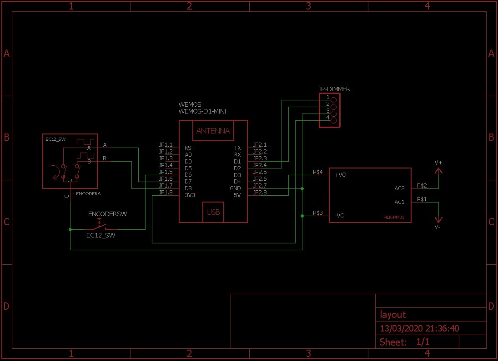

# AlexaLamp
This project is to create a lamp with Alexa voice control where you can also change the brightness using a rotary encoder with push switch.

## Hardware:

* Wemos D1 Mini
* HLK-PM01 AC-DC 220V to 5v mini power supply module
* Robotdyn AC Light Dimmer Module (https://robotdyn.com/ac-light-dimmer-module-1-channel-3-3v-5v-logic-ac-50-60hz-220v-110v.html)
* KY-040 rotary encoder with push switch

## How to use

The lamp has 2 modes: Alexa (default) and standalone.  To change mode, power cycle the lamp whilst holding the rotary encoder push switch down.  When the device boots it will flash to let you know which mode it is in.  1 flash indicates standalone and 2 flashes is Alexa mode.

### Alexa mode (default)
* When the lamp is turned on for the first time it will create an unsecured wifi hotspot called Lamp
* You can use your phone to connect to the hotspot and enter your wifi network credentials
* Once your credentials are verified, the hotspot will disappear and your settings will be stored
* The lamp will now connect to your network and you will be able to control the lamp using the rotary encoder
* Say "Alexa, discover devices" or go to the Alexa app, hit "Add Device", "Other", "Discover devices"
* If the lamp cannot connect to a network using its stored settings, it will create a new hotspot and wait for the new credentials (when not connected to wifi the rotary encoder will not work)

### Standalone mode

* This mode does not connect to any wifi networks or create any hotspots
* Plain old lamp
* Rotary encoder works straight away

### Alexa voice control

Once setup, you can use different ways to invoke Alexa to modify the device's state:

* Alexa, turn lamp on
* Alexa, turn on lamp
* Alexa, set lamp to fifty (50 means 50% of brightness)
* Alexa, set lamp to one hundred (100% brightness)
